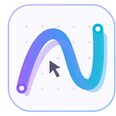

<p align="center">
  <a href="https://nezumo.ru">
    
  </a>
</p>

<h1 align="center">Nezumo Web</h1>

<p align="center">
  The website for <a href="https://nezumo.ru">Nezumo</a>,
  an infinite online canvas for collaborative thinking, planning, and presentations.
</p>

## About

This repository contains the public Nezumo website. It is a standalone static
Astro project and does not depend on the main Nezumo application or its source
code.

The website includes:

- Product and download pages
- A public product roadmap
- A feature request form
- A Markdown-powered changelog
- Terms, privacy, refund, and contact pages

Russian is the default language and uses root-level routes. English pages use
the `/en/` prefix. The language switcher keeps visitors on the corresponding
page whenever they change languages.

## Tech stack

- [Astro](https://astro.build/) for static site generation
- [Tailwind CSS](https://tailwindcss.com/) for styling
- [Bun](https://bun.sh/) for package management and scripts
- [nginx](https://nginx.org/) for serving the generated static website

## Getting started

### Prerequisites

Install [Bun](https://bun.sh/docs/installation), then clone the repository and
install its dependencies:

```bash
git clone https://github.com/OctaHive/nezumo-web.git
cd nezumo-web
bun install
```

### Environment variables

The project works with its production defaults out of the box. To override
them locally, copy the example environment file:

```bash
cp .env.example .env
```

Available variables:

| Variable | Purpose | Default |
| --- | --- | --- |
| `PUBLIC_APP_ORIGIN` | Nezumo application URL used by sign-in and sign-up links | `https://app.nezumo.ru` |
| `PUBLIC_API_ORIGIN` | API origin used by the feature request form | Same as `PUBLIC_APP_ORIGIN` |
| `PUBLIC_DESKTOP_MACOS_VERSION` | Displayed macOS app version | `0.1.12` |
| `PUBLIC_DESKTOP_MACOS_URL` | Custom macOS download URL | Generated from the version |
| `PUBLIC_DESKTOP_WINDOWS_VERSION` | Displayed Windows app version | `0.1.12` |
| `PUBLIC_DESKTOP_WINDOWS_URL` | Custom Windows download URL | Generated from the version |
| `PUBLIC_DESKTOP_LINUX_URL` | Linux download URL | No default; shown as coming soon |

### Development

Start the local development server:

```bash
bun run dev
```

The website will be available at <http://localhost:4321>.

## Scripts

| Command | Description |
| --- | --- |
| `bun run dev` | Start the local development server |
| `bun run check` | Run Astro and TypeScript diagnostics |
| `bun run build` | Build the production website into `dist/` |
| `bun run preview` | Preview the production build locally |

## Project structure

```text
.
├── content/            # Markdown changelog entries
├── layouts/            # Shared page layout and navigation
├── pages/              # Russian routes and English routes under /en
├── public/             # Images, fonts, icons, and static metadata
├── styles/             # Global styles
├── astro.config.mjs    # Astro configuration
└── content.config.ts   # Changelog collection schema
```

## Localization

Keep equivalent Russian and English routes in sync when adding pages. Russian
changelog entries live in `content/updates/`; their English counterparts live
in `content/updates/en/` and must use the same filename so the language switcher
can preserve the current article.

The shared layout provides localized navigation, footer content, document
language attributes, canonical URLs, `hreflang` links, and Open Graph locale
metadata.

## Deployment

Create and validate a production build:

```bash
bun run check
bun run build
```

The generated static website is written to `dist/`. Upload the **contents** of
this directory to the document root configured for `nezumo.ru` on your nginx
server.

A minimal nginx location for the website looks like this:

```nginx
location / {
    try_files $uri $uri/ =404;
}

location /_astro/ {
    expires 1y;
    add_header Cache-Control "public, immutable";
}
```

Reload nginx after publishing the new files. Since Astro generates an
`index.html` file for every route, no application server or server-side runtime
is required.

## License

This project is available under the [MIT License](./LICENSE).
